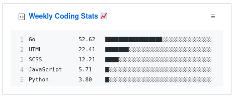

# WeeklyCodingStats

This is a weekly coding stats
📊   ascii bar chart generator which uses the WAKATIME API to keep track of your coding stats.
It's inspired from Atul Cyriac Ajay's [wakatime-metrics](https://github.com/athul/wakatime-metrics) which is originally written in python.
I just implemented it from scratch so that I can learn more about API's and Authorization in http requests and stuff like that (And also cus Iam bored af 
😐).

The Program uses GitHub Gists API to update a Gist.

The ASCII bar chart will look like this 👇

To set this up yourself you must have go installed and also should have wakatime IDE plugins tracking your coding activity:
Then Follow these steps :

1) Create a Gist and Get the Gist ID 
2) Clone this Repo
3) Set 
